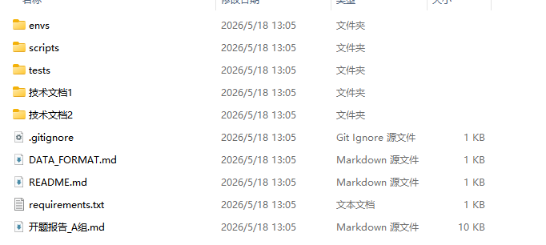
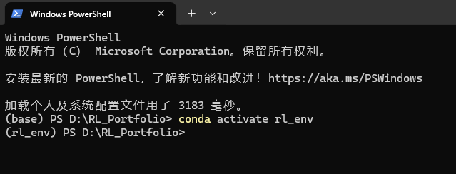
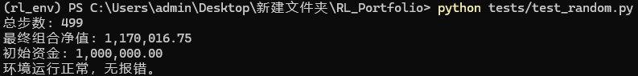

# 技术文件1

**更新日期：** 2026-05-07  
**编写人：** 胡锦宏  
**内容：** 本地环境配置与复现指南

## 1. 当前完成状态

我这边已经搭好了最基础的交易环境 `PortfolioEnv`，基于 Gymnasium 框架。该环境支持连续动作空间的多资产仓位分配，已完成随机策略测试，可正常执行完整 episode。

我在GitHub上新建了仓库 `GalleryZYX/RL_Portfolio` ，包含以下核心文件：

| 文件路径 | 功能说明 |
|---------|---------|
| `envs/portfolio_env_test.py` | 用于test_random.py运行的环境，是最基础的交易环境 |
| `envs/portfolio_env.py` | 根据数据格式进行修改后的交易环境核心代码，包含状态转移、收益计算、交易成本扣除逻辑，是后续用于训练的环境|
| `tests/test_random.py` | 环境验证脚本，使用随机策略执行完整 episode |
| `requirements.txt` | 项目依赖清单，确保各成员本地环境版本一致 |
| `.gitignore` | 排除规则，避免虚拟环境及数据缓存文件进入版本控制 |
| `DATA_FORMAT.md` | 数据格式说明文件|
| `开题报告_A组.md` | 开题报告|
| `scripts/train_ppo_pendulum.py`|PPO的SB3官方环境复现脚本|

当前环境使用模拟数据运行通过，尚未接入真实股票日线数据。

## 2. 本地复现步骤

### 2.1 前置依赖

- Python环境管理工具：[Anaconda](https://www.anaconda.com/) 或 Miniconda（**这是我个人常用的，后续PowerShell中的安装命令也是基于conda的。如果你有其他管理工具，记得修改这些命令语法**）
- Git（Windows 用户可通过 https://git-scm.com/download/win 下载安装）

### 2.2 克隆仓库

在你想要存放大作业文件的文件夹中（我是直接放在D盘的）打开PowerShell ，执行：

```bash
git clone https://github.com/GalleryZYX/RL_Portfolio.git
cd RL_Portfolio
```
克隆那一步可能会显示失败，说不定是github的半墙状态导致的，反正就多试几次\开关梯子\换wifi之类的方法多试几次吧，成功之后你应该会有一个名为**RL_Portfolio**的文件夹，里面内容如下：

**最后，请在这个文件夹里创建一个名为data的文件夹，这个文件夹后续用来装数据**
### 2.3 创建并激活 Python 3.10 虚拟环境

我的想法是单独为大作业创建一个python环境，这样帮我们避免彼此包版本不同导致的奇怪的问题。在PowerShell中运行：

```bash
conda create -n rl_env python=3.10 -y #创建环境
conda activate rl_env #切换到这个环境
```
这会创建一个名为**rl_env**的python环境。激活后，终端提示符前将显示 `(rl_env)`。类似下图：

### 2.4 安装项目依赖

在 `RL_Portfolio` 根目录下打开PowerShell，执行：

```bash
pip install -r requirements.txt
```

该命令将安装 Gymnasium、Pandas、NumPy、Matplotlib 等当前阶段必需依赖，版本与我这边的严格一致。

### 2.5 运行测试脚本验证环境

在 RL_Portfolio 根目录下打开PowerShell，执行：
```bash
python tests/test_random.py
```

预期输出示例：

```
总步数: 499
最终组合净值: 1,144,391.00
初始资金: 1,000,000.00
环境运行正常，无报错。
```

**判定标准：** 脚本执行无报错，完整跑完 499 步并输出最终净值，即表示本地环境复现成功。最终净值因随机策略及模拟数据特性可能存在波动，不影响环境正确性判定。


## 3. 项目目录结构

```
RL_Portfolio/
├── envs/
│   ├── __init__.py
│   ├── __init__.py               # 用于测试的交易环境类
│   └── portfolio_env.py          # 用于训练的交易环境类
├── tests/
│   └── test_random.py            # 环境功能验证脚本
├── data/                         # 股票日线数据存放目录（当前为空，待补充）
├── requirements.txt              # Python 依赖清单
├── .gitignore                    # Git 排除规则
└── scripts                       # 脚本文件存放
    └── train_ppo_pendulum.py       
```

## 4. 协作规范

1. **数据文件不上传仓库。** `data/` 目录已被 `.gitignore` 排除。后续下载的股票数据及 API Token 相关文件仅保留在本地，避免仓库体积膨胀及敏感信息泄露。
2. **依赖变更需同步。** 若后续安装新的 Python 包，执行 `pip freeze &gt; requirements.txt` 更新清单，并提交至仓库，确保各成员环境同步。
3. **执行前检查虚拟环境激活状态。** 若出现 `ModuleNotFoundError`，首先确认当前终端是否已执行 `conda activate rl_env`。

---


