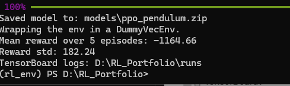

# 技术文件2

**更新日期：** 2026-05-18  
**内容提供：** 纪鈜昱
**编写人：** 胡锦宏  
**内容：** Stable Baselines3 安装与官方 PPO 示例

## 1. 前置要求
确保已经克隆了仓库：https://github.com/GalleryZYX/RL_Portfolio
如果没有，请在powershell中运行：
```bash
git clone https://github.com/GalleryZYX/RL_Portfolio.git
```
确保按照技术文件1中要求配置了相应的python环境，如果没有，请在powershell中运行：：
```bash
conda create -n rl_env python=3.10 -y #创建名为rl_env的python3.10环境，如果已经有了，跳过这个命令
conda activate rl_env #切换到这个环境
pip install -r requirements.txt
```
## 2. 运行官方PPO示例
项目新增了一个官方环境复现脚本：

```text
scripts/train_ppo_pendulum.py
```

该脚本用于跑通 Stable Baselines3 的 PPO 训练流程，环境为 Gymnasium `Pendulum-v1`。它会完成：

- 创建 `Pendulum-v1` 环境
- 使用 PPO + `MlpPolicy` 训练智能体
- 保存模型到 `models/ppo_pendulum.zip`
- 重新加载模型并评估平均奖励
- 写入 TensorBoard 日志到 `runs/`
### 2.1 CPU运行方法：
```bash
python scripts/train_ppo_pendulum.py --device cpu
```
### 2.2 GPU运行方法：
**要求有invidia的显卡**。先查看自己的显卡是否支持英伟达的CUDA（英伟达创建的GPU并行计算平台与编程模型，是利用GPU进行加速运算的必备工具），请在powershell中输入：
```bash
nvidia-smi
```
如图：这里显示我的显卡最高支持13.1版本的CUDA，即13.1及之前的版本都可以用。


确保自己的GPU所支持的最高版本CUDA后，安装CUDA版PyTorch:
```bash
pip install torch==2.7.1 torchvision==0.22.1 torchaudio==2.7.1 --index-url https://download.pytorch.org/whl/cu128
```
然后运行：
```bash
python scripts/train_ppo_pendulum.py
```
如果你想指定某个GPU,如GPU 0，则运行：
```bash
python scripts/train_ppo_pendulum.py --device cuda:0
```
可选参数示例：

```bash
python scripts/train_ppo_pendulum.py --device cpu --total-timesteps 50000 --eval-episodes 10
```

预期输出会包含类似内容：

```text
Saved model to: models/ppo_pendulum.zip
Mean reward over 5 episodes: -1165.97
Reward std: 181.66
TensorBoard logs: /path/to/RL_Portfolio/runs
```


注意：`Pendulum-v1` 的奖励通常为负数，越接近 0 表示表现越好。本脚本当前主要用于确认 SB3 训练、保存、加载、评估和日志链路正常，不追求最优成绩。

查看 TensorBoard：

```bash
tensorboard --logdir runs
```

随后打开终端显示的本地网页地址，通常为 `http://localhost:6006`。

