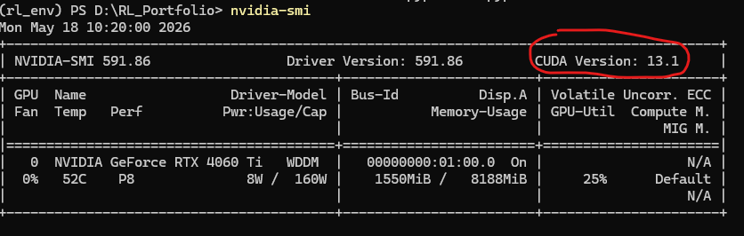
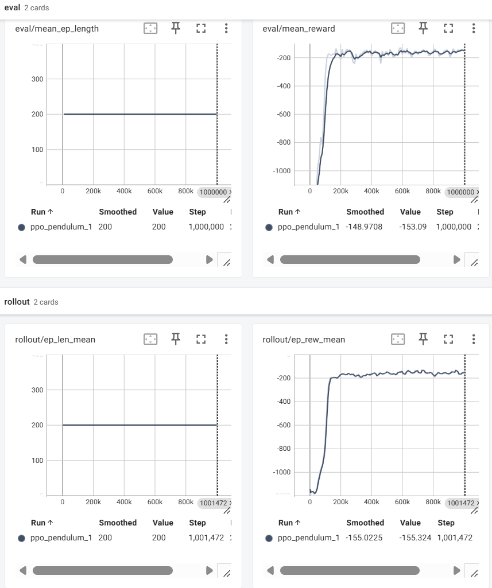

# 技术文件2

**更新日期：** 2026-05-18  
**内容提供：** 纪鈜昱
**编写人：** 胡锦宏  
**内容：** Stable Baselines3 安装与官方 PPO 示例

## 1. 前置要求
确保已经克隆了仓库：https://github.com/GalleryZYX/RL_Portfolio
如果没有，请在powershell中运行：
```bash
git clone https://github.com/GalleryZYX/RL_Portfolio.git
```
确保按照技术文件1中要求配置了相应的python环境，如果没有，请在powershell中运行：：
```bash
conda create -n rl_env python=3.10 -y #创建名为rl_env的python3.10环境，如果已经有了，跳过这个命令
conda activate rl_env #切换到这个环境
pip install -r requirements.txt
```
## 2. 运行官方PPO示例
项目新增了一个官方环境复现脚本：

```text
scripts/train_ppo_pendulum.py
```

该脚本用于跑通 Stable Baselines3 的 PPO 训练流程，环境为 Gymnasium `Pendulum-v1`。它会完成：

- 创建 `Pendulum-v1` 环境
- 使用 PPO + `MlpPolicy` 训练智能体
- 保存模型到 `models/ppo_pendulum.zip`
- 重新加载模型并评估平均奖励
- 写入 TensorBoard 日志到 `runs/`
### 2.1 CPU 运行（推荐，MLP PPO 在该示例上通常比 GPU 更合适）：
```bash
python scripts/train_ppo_pendulum.py 
```
### 2.2 GPU运行方法：
**要求有invidia的显卡**。先查看自己的显卡是否支持英伟达的CUDA（英伟达创建的GPU并行计算平台与编程模型，是利用GPU进行加速运算的必备工具），请在powershell中输入：
```bash
nvidia-smi
```
如图：这里显示我的显卡最高支持13.1版本的CUDA，即13.1及之前的版本都可以用。


确保自己的GPU所支持的最高版本CUDA后，安装CUDA版PyTorch:
```bash
pip install torch==2.7.1 torchvision==0.22.1 torchaudio==2.7.1 --index-url https://download.pytorch.org/whl/cu128
```
指定 GPU（例如 GPU0）运行：

```bash
CUDA_VISIBLE_DEVICES=0 python scripts/train_ppo_pendulum.py --device cuda:0
#胡锦宏注：这是纪鈜昱给我的文档中所写的，但实际在我自己电脑上运行时，我需要去掉开头的 CUDA_VISIBLE_DEVICES=0 ，供参考
```

可选参数示例：

```bash
python scripts/train_ppo_pendulum.py --total-timesteps 300000 --eval-episodes 20
```

脚本已暴露常用 PPO 超参数，便于后续调参：

```bash
python scripts/train_ppo_pendulum.py \
  --learning-rate 0.0003 \
  --n-steps 2048 \
  --batch-size 512 \
  --n-epochs 10 \
  --gamma 0.99 \
  --gae-lambda 0.95 \
  --clip-range 0.2 \
  --ent-coef 0.0 \
  --vf-coef 1.0 \
  --target-kl 0.03 \
  --net-arch 128,128
```


默认启用 `VecNormalize` 对 observation 和 reward 做归一化，以改善 critic 对 value function 的学习。训练完成后会额外保存：

```text
models/ppo_pendulum_vecnormalize.pkl
```

如果只想运行不带归一化的基础 PPO，可加入：

```bash
python scripts/train_ppo_pendulum.py --no-normalize
```

如果希望达到某个评估奖励后提前停止，可以设置早停阈值：

```bash
python scripts/train_ppo_pendulum.py --total-timesteps 1000000 --reward-threshold -300 --eval-freq 10000
```
预期会产生如下文件/目录：

models/
├── ppo_pendulum.zip # 最终训练完成后保存的 PPO 模型
├── ppo_pendulum_vecnormalize.pkl # VecNormalize 的归一化统计量。只要启用了默认的 --normalize，这个文件就会生成。以后加载模型评估或推理时，最好和模型一起使用。
└── best_ppo_pendulum/
    └── best_model.zip # 训练过程中由 EvalCallback 保存的“当前评估表现最好”的模型

runs/
├── ppo_pendulum_*/ # TensorBoard 训练日志。每跑一次通常会生成新的编号目录，比如 ppo_pendulum_1、ppo_pendulum_2
│   └── events.out.tfevents.*
└── eval/
    ├── evaluations.npz # 评估回调保存的评估结果，包括每次 eval 的 reward、episode length 等。
    └── maybe more TensorBoard/eval logs

预期输出会包含类似内容：

```text
Saved model to: models/ppo_pendulum.zip
Saved VecNormalize statistics to: models/ppo_pendulum_vecnormalize.pkl
Mean reward over 20 episodes: -xxx.xx
Reward std: xxx.xx
TensorBoard logs: /path/to/RL_Portfolio/runs
```

注意：`Pendulum-v1` 的奖励通常为负数，越接近 0 表示表现越好。本脚本当前主要用于确认 SB3 训练、保存、加载、评估和日志链路正常，不追求最优成绩。

查看 **TensorBoard**：

```bash
tensorboard --logdir runs
```

随后打开终端显示的本地网页地址，通常为 `http://localhost:6006`。

在tensorboard里预期会看到四个图：

rollout/* = 训练过程中采样到的表现
eval/*    = 定期评估时的表现